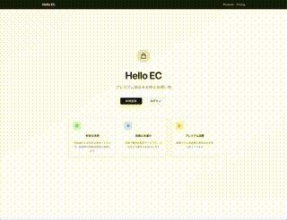

# Next.js Stripe EC Site



**Modern EC site with subscription support integrating Clerk authentication and Stripe payments**

A full-featured EC platform with functionality for SaaS applications.

## Setup Instructions

### 1. Stripe Setup (Payments and Product Configuration)

- [Stripe Account Setup](docs/stripe-01-setup.md)
- [Create Products and Prices](docs/stripe-02-product-and-price.md)
- [Webhook Configuration](docs/stripe-03-webhook.md)

### 2. Clerk Setup (Authentication and User Management)

- [Clerk Authentication Setup](docs/clerk.md)
- [Clerk Billing Setup](docs/clerk-billing-setup.md)

### 3. Install Dependencies

```bash
npm install
```

### 4. Environment Variables Setup

Create a `.env.local` file and add the following content:

```env
# Stripe Configuration
STRIPE_API_KEY=rk_test_your_restricted_key_here
NEXT_PUBLIC_STRIPE_PUBLISHABLE_API_KEY=pk_test_your_publishable_key_here
STRIPE_WEBHOOK_SECRET=whsec_your_webhook_secret_here

# API URL (required in production)
NEXT_PUBLIC_API_URL=http://localhost:3000

# Clerk Configuration
NEXT_PUBLIC_CLERK_PUBLISHABLE_KEY=pk_test_your_clerk_publishable_key_here
CLERK_SECRET_KEY=sk_test_your_clerk_secret_key_here
```

### 5. Update Product Data

Edit `pages/api/products.ts` and configure the product data created in Stripe.

## Local Development

### Start Development Server

```bash
npm run dev
```

You can view the application at [http://localhost:3000](http://localhost:3000).

**Note**: The development server is accelerated using Turbopack.

### Code Quality Check

```bash
npm run lint        # Check code quality with ESLint
npx tsc --noEmit    # TypeScript type check
npm run build       # Production build
```

## Main Features

### Page Structure

- **`/` (Homepage)**
  - Unauthenticated: Stylish landing page (with sign-up/login buttons)
  - Authenticated: Product listing page

- **`/pricing`**
  - Subscription plan display
  - Uses Clerk's pricing table component
  - 14-day free trial support

- **`/account`**
  - User profile management
  - Subscription and billing settings
  - Authentication required

- **`/monitoring`**
  - Premium feature: Business analytics dashboard
  - Feature-based access control
  - Upgrade prompt display

- **`/sign-in` / `/sign-up`**
  - Authentication pages by Clerk (modal display)
  - Google OAuth support

- **`/success`**
  - Payment completion page
  - Redirect destination from Stripe

- **`/subscription-success`**
  - Subscription completion page

### API Endpoints

- **`/api/products`**: Fetch product data
- **`/api/checkout`**: Create checkout session (authentication required)
- **`/api/create-subscription`**: Create subscription (authentication required)
- **`/api/webhooks`**: Stripe webhook processing

### Core Features

#### 🔐 Authentication & User Management (Clerk)

- **Multiple authentication methods**: Email/Password, Google OAuth
- **User management**: Profile, account settings
- **Session management**: Secure and persistent login
- **Organization management**: Team and organization support (Organization feature)

#### 💳 Payments & Subscriptions (Stripe)

- **One-time purchase**: Secure payments via Stripe Checkout
- **Subscriptions**: Recurring billing plan support
- **Billing management**: Clerk billing portal integration
- **Webhook processing**: Real-time payment status updates

#### 🛡️ Security & Authorization

- **Route guards**: Protection for pages requiring authentication
- **Feature-based authorization**: Access control for premium features
- **API security**: Protection for authentication-required endpoints

## Test Information

### Stripe Test Card Numbers

- **Success**: 4242 4242 4242 4242
- **Failure**: 4000 0000 0000 0002
- **CVV**: Any 3-digit number
- **Expiration**: Any future date

## Production Environment Setup

Please refer to the [Production Setup Guide](docs/production-setup.md).

## Technology Stack

### Frameworks & Libraries

- **Frontend**: [Next.js 15](https://nextjs.org/) (with Turbopack)
- **React**: v19.1.1
- **TypeScript**: Type-safe development environment
- **UI Components**: [ShadCN/UI](https://ui.shadcn.com/) + [Lucide Icons](https://lucide.dev/)
- **Styling**: [Tailwind CSS](https://tailwindcss.com/)

### Authentication & Payment

- **Authentication**: [Clerk](https://clerk.com/docs/quickstarts/nextjs) - Modern user management
- **Payment**: [Stripe](https://docs.stripe.com/) - Secure and flexible payment processing

### Development & Quality Management

- **Code Quality**: ESLint + Prettier
- **Git Hooks**: Husky + lint-staged
- **Developer Experience**: Turbopack (Fast development server)

## Architecture Features

### 🚀 SaaS Ready

- Subscription model support
- Feature-based access control
- Organization and team management support

### 🔧 Developer Experience

- Full TypeScript support
- Automatic linting and formatting
- Hot Reload (Turbopack)

### 📈 Scalability

- **Clerk + Stripe**: Integrated authentication and payment architecture
- **Free tier**: Clerk 10,000 MAU, rich features
- **Details**: [Technology Stack Comparison](docs/techstack.md)

## References

- Framework: [Next.js](https://nextjs.org/)
- Auth: [Clerk Documentation](https://clerk.com/docs/quickstarts/nextjs)
- UI: [ShadCN/UI](https://ui.shadcn.com/)
- Payment: [Stripe Documentation](https://docs.stripe.com/)
- Deployment: [Vercel](https://vercel.com/)
- Blog: [Simple EC Site Development Workshop with Next.js and Stripe](https://zenn.dev/stripe/books/stripe-nextjs-use-shopping-cart)
